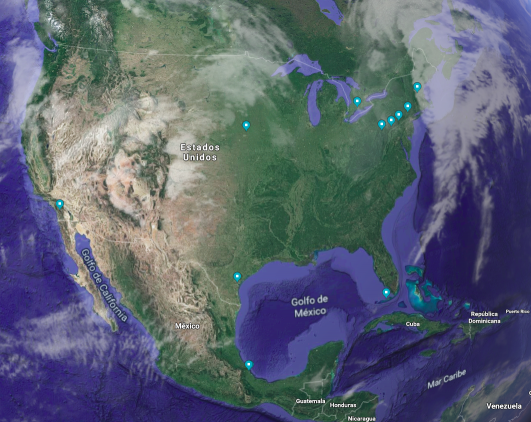

# Temporal Data Visualization: Raptor long-term count and monitoring

## Contents
- [Raptor migration](#section1)  
- [Case study](#section2)  
- [Count data as Time Series](#section3)      
- [Time series data visualization](#section4)   
- [Objectives](#section5)  

## Raptor migration

On North America, every fall and spring raptors migrate to warmer climates, creating one of the greatest events on earth. Thousands of birds of prey from several species migrate using different strategies, some species are **solitary migrants** and other species form large **flocks**. Although, raptors generally prefer to migrate over level terrain sparsely. Mountains, oceans and lakes form natural barriers where birds converge along narrow pathways, generating an opportunity to readily observe and monitor the mass migration. 

There are several long-term programs to monitor raptor abundance in North America. During monitoring, observers systematically count individuals of different diurnal raptors and collect data on weather and observation conditions. Four leading migration research organizations are:  

* The Hawk Migration Association of North America (HMANA)  
* Hawk Mountain Sanctuary (HMS)  
* HawkWatch International (HWI)  
* Bird Studies Canada (BSC).  

The [Raptor Population Index (RPI)](http://rpi-project.org/data_collection.php) project represents a partnership between these four organizations in order to standardize raptor migration monitoring to detect temporal trends for species populations. RPI data has been collected from over 300 raptor watchsites operated by professionals and citizen-scientists for more than two decades. Each watch site has an operating protocol for data gathering, based on a [generalized site data collection protocol](http://rpi-project.org/docs/HMANA_Data_Collection_Protocol_20060611.pdf).

## Case study

Hawk count data collected by [HMANA](https://www.hawkcount.org/) will be used. Data come from monitoring sites throughout the United States, Canada, and Mexico.

The counts from watchsites consist of tabular data with the following structure:

- The columns include the count data for 30 raptor species and 9 columns for climate variables. 

- The rows contain abundance data for raptors and climate variables measured **per day and per hour**

     -Daily migration monitoring is carried out from 9:00 to 18:00 hours in most cases, during spring and autumn seasons.
     
     -For this analysis only **autumn data** will be used (August 20 - November 20).

- The data include hawk data **from 2008 to 2017** for the following **12 sites**:

    - Allegheny Front (USA)
    
    - Corpus Christi (USA)
    
    - Detroit River Hawk Watch (USA)
    
    - Florida Keys Hawkwatch (USA)
    
    - Hawk Cliff Hawkwatch (Canada)
    
    - Hawk Mountain Sanctuary (USA)
    
    - Hitchcock Nature Center (USA)
    
    - Mount Peter (USA)
    
    - Pack Monadnock Raptor Migration Observatory (USA)
    
    - Veracruz River of Raptors Cardel, MX (Mexico)
    
    - Veracruz River of Raptors Chichicaxtle, MX (Mexico)
    
    - Waggoner's Gap (USA)

    

  

<em>HMANA sites distribution</em>
</p
   

## Count data as Time Series

Daily migration monitoring data generates time series at different scales. A time series is a sequence of points measured at consistent time intervals. Time series data may include intervals of years, months, days, hours, and so on. 

Monitoring data may be heterogeneous among sites and even among years in sites. Major challenges to analyze raptor counts as a time series are:

* Missing data: hours of day without data for some years at some sites. 

* Zero-inflated count data. 

* Biased distribution: many days when censuses have low or moderate results and few days when censuses report several birds.

## Time series data visualization

Visualization is an important step in time series analysis, because it allows to identify temporal patterns, cycles or seasonality from data. Plotting time series at different time scales from a proper preprocessing of data can influence the definition of the best scale to use in time series forecasting. 

There are different types of visualizations for time series, line plots are the most common approach. In this anaylisis, I will take a look at **heatmaps** as a option to visualize patterns in **Time Series data** at differente time scales.

## Objectives

The main objectives are:

* Show the necessary preprocessing in time series data to generate heatmaps at different time scales. 

* Show heatmaps as a type of visualization to detect patterns in time series data. 

## Author

Ruth Elena Delgado Dávila

## License
This project is licensed under the MPL2.0 License - see the LICENSE file for details

## Citations

Bildstein K.L. 1998. Long-term counts of migrating raptors: A role for volunteers in wildlife research. Journal of wildlife management 62(2): 435-445.  

Farmer C.J., D.J.T. Hussell & D. Mizrahi. 2007. Detecting population trends in migratory birds of pray. The Auk, 124(3): 1047-1062.  

