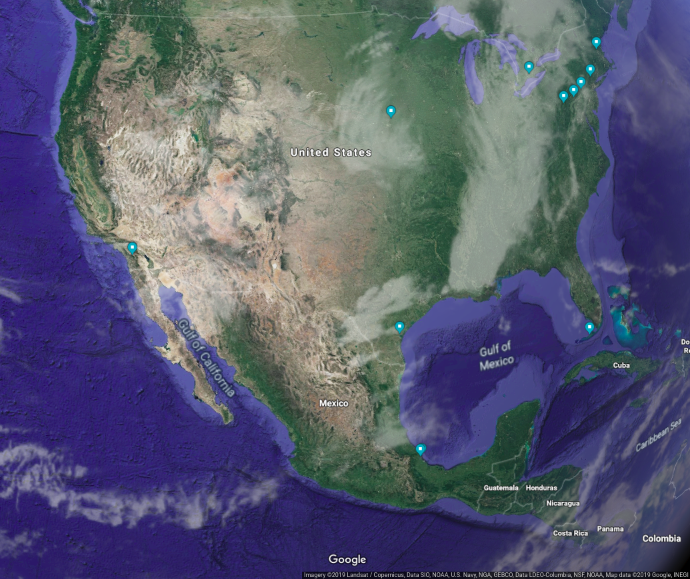

# Temporal Data Visualization: Raptor long-term count and monitoring

## Time series data visualization

A time series is a sequence of points measured at different time intervals. Visualization is an important step in time series analysis, because it allows us to identify temporal patterns, cycles or seasonality from data. Plotting time series at different time scales from a proper preprocessing of the data can influence the definition of the best scale to use in time series forecasting. 

There are different types of visualizations for time series (e.g. line plots, density plots and heat maps). Although line plots are the most common approach, heatmaps are better able to display temporal patterns intuitively. In heatmaps a matrix is represented as a gradient of colors, where larger values are drawn with warmer colors and smaller values are assigned cooler colors. 

In this analysis, I will present an insight into **heatmaps** to visualize patterns in **Time Series data** at different time scales. The objectives of this analysis are: Show the necessary [preprocessing in time series data](https://github.com/REDD1326/Time_Series_Data_Visualization/blob/master/DataExploration%26Preprocessing.ipynb) to generate heatmaps at different time scales, and illustrate the use of [heatmaps](https://github.com/REDD1326/Time_Series_Data_Visualization/blob/master/TimeSeriesDataVisualization.ipynb) to detect patterns in time series data.

## Case study

### Raptor migration

Raptors (also known as birds of prey), are birds that hunt and feed on other animals. On North America, every fall and spring raptors migrate to warmer climates, creating one of the greatest natural events on earth. Thousands of raptors participate in this migration, but different species use different migration strategies. Some species are solitary migrants and other species form large flocks (some flocks contain up to 15000 birds). Raptors generally prefer to migrate over level ground, thus mountains, oceans and lakes form natural barriers where the birds converge. These narrow pathways generate an opportunity for researchers to readily observe and monitor their mass migration. 

There are several long-term programs to monitor raptor abundance in North America. During monitoring, observers systematically count individuals of different diurnal raptors and collect data on weather and observation conditions. The [Raptor Population Index (RPI)](http://rpi-project.org/data_collection.php) project represents a partnership between four organizations in order to standardize raptor migration monitoring to detect temporal trends for species populations. RPI data has been collected from over 300 raptor watchsites operated by both professionals and citizen-scientists for more than two decades. Each watch site has an operating protocol for data gathering, based on a [generalized site data collection protocol](http://rpi-project.org/docs/HMANA_Data_Collection_Protocol_20060611.pdf).

### Monitoring data

Hawk count data collected by [HMANA](https://www.hawkcount.org/) will be used. Data comes from monitoring sites throughout the United States, Canada, and Mexico.

The counts from watchsites consist of tabular data with the following structure:

- Columns include the count data for 30 raptor species and 9 climate variables. 

- Rows contain abundance data for raptors and climate variables measured **per day and per hour**

     Daily migration monitoring is carried out from 9:00 to 18:00 hours in most cases, during spring and autumn seasons.
     
     For this analysis only **autumn data** will be used (August 20 - November 20).

- We include monitoring data **from 2008 to 2017** for the following **12 sites**:

    - Allegheny Front (USA)
    
    - Corpus Christi (USA)
    
    - Detroit River Hawk Watch (USA)
    
    - Florida Keys Hawkwatch (USA)
    
    - Hawk Cliff Hawkwatch (Canada)
    
    - Hawk Mountain Sanctuary (USA)
    
    - Hitchcock Nature Center (USA)
    
    - Mount Peter (USA)
    
    - Pack Monadnock Raptor Migration Observatory (USA)
    
    - Veracruz River of Raptors Cardel, MX (Mexico)
    
    - Veracruz River of Raptors Chichicaxtle, MX (Mexico)
    
    - Waggoner's Gap (USA)

    

  

<em>HMANA sites distribution</em>

## License  

This project is licensed under the MPL2.0 License - see the LICENSE file for details

## Bibliography

Bildstein K.L. 1998. Long-term counts of migrating raptors: A role for volunteers in wildlife research. Journal of wildlife management 62(2): 435-445.  

Farmer C.J., D.J.T. Hussell & D. Mizrahi. 2007. Detecting population trends in migratory birds of prey. The Auk, 124(3): 1047-1062.  

